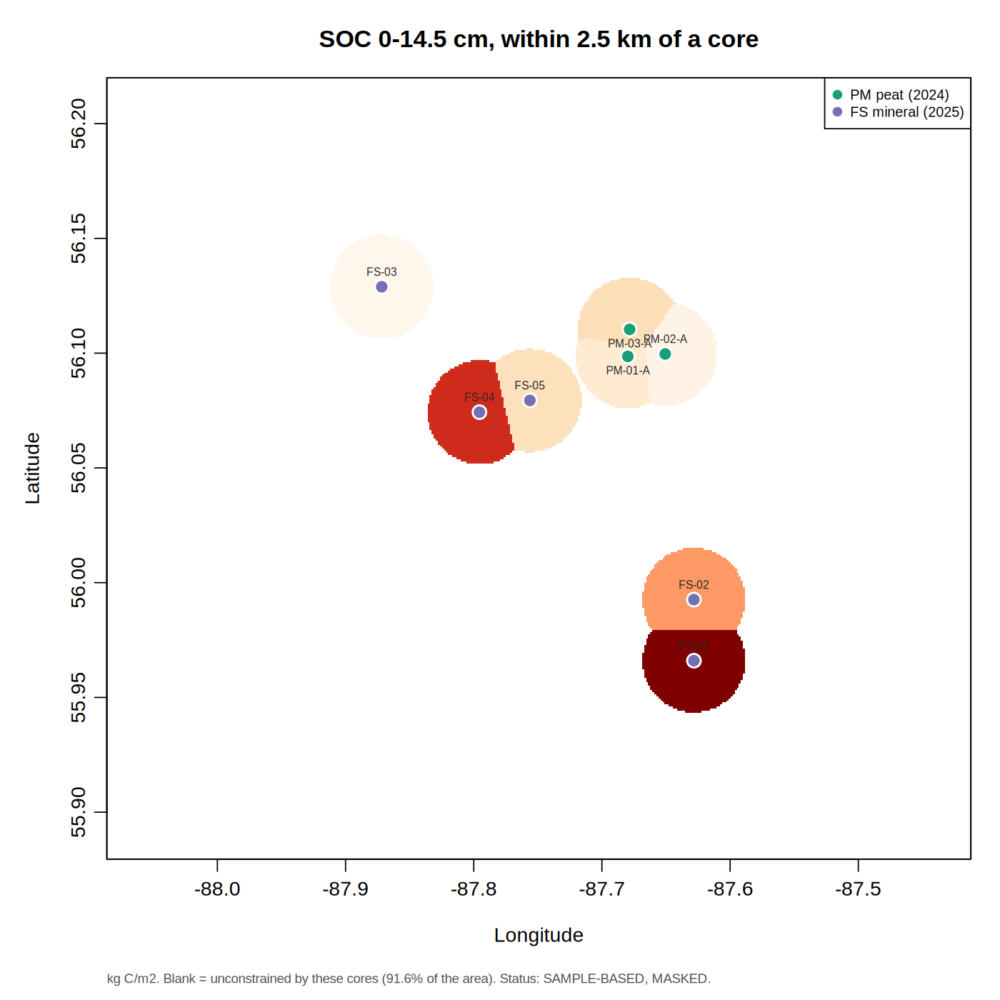
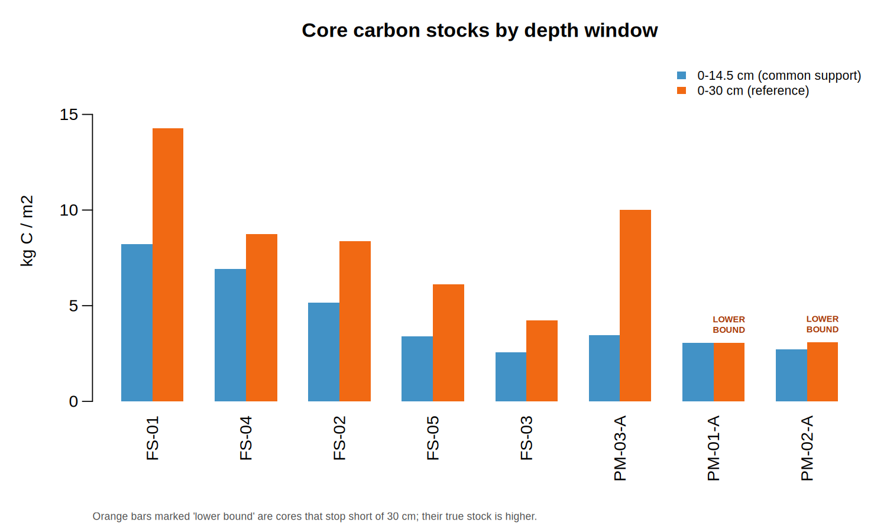
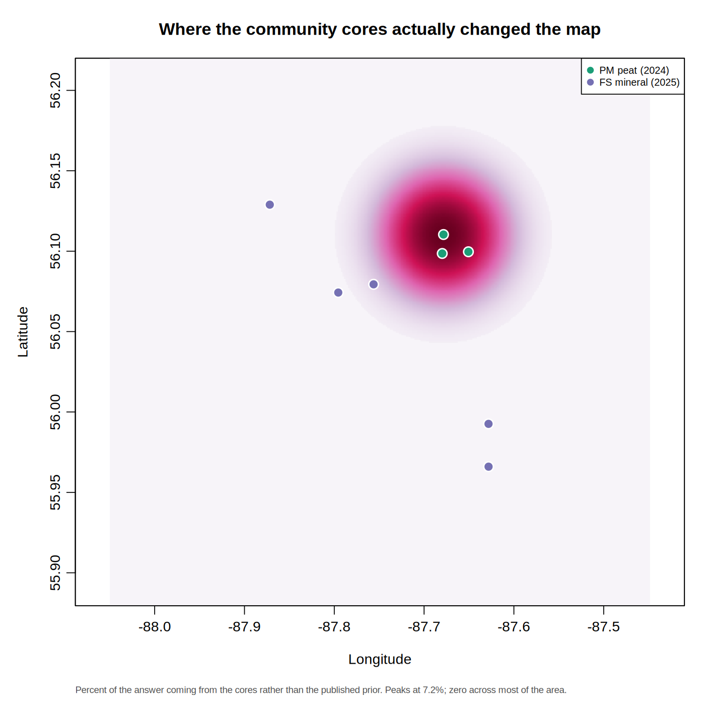
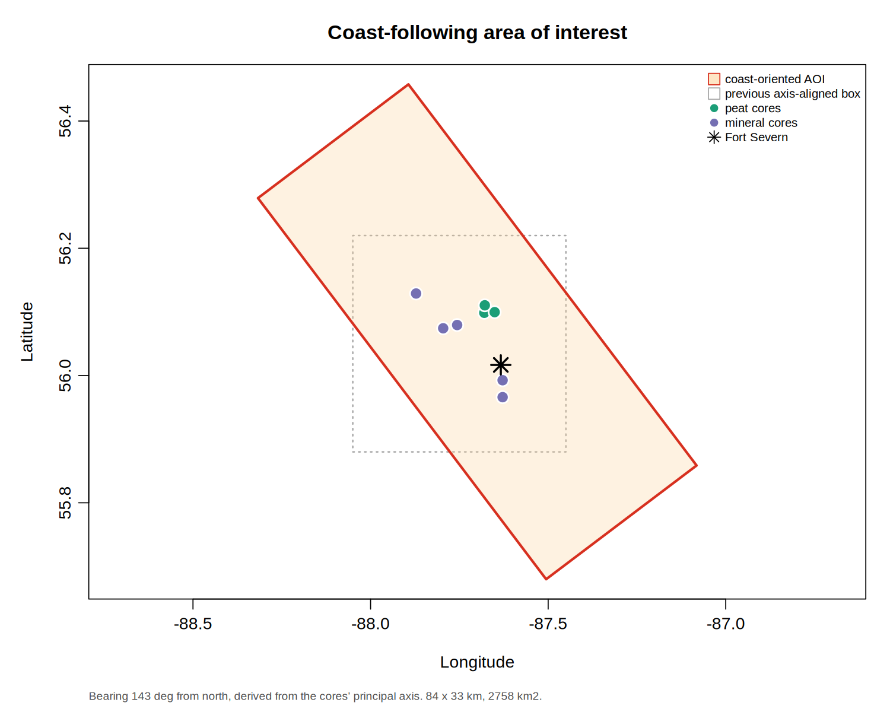
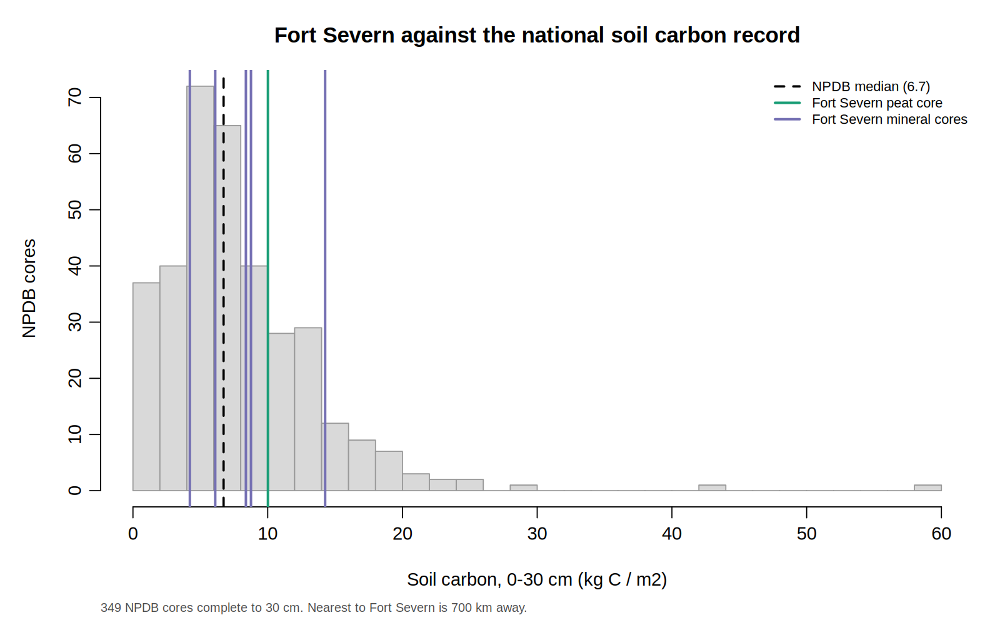
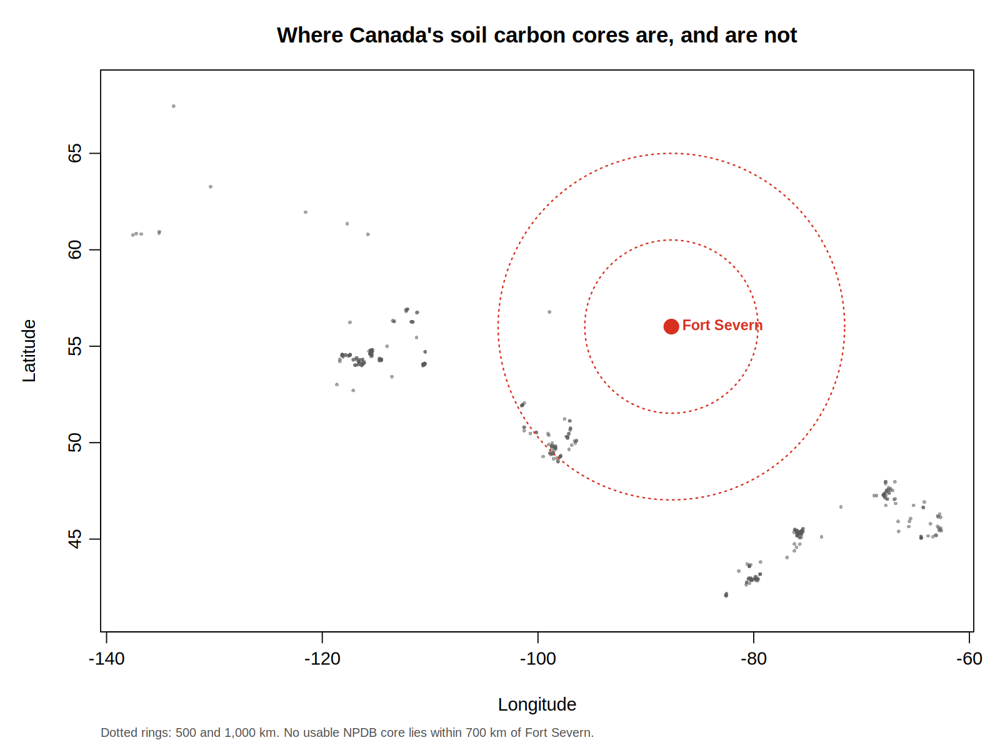

# In one paragraph

Community members collected **8 soil cores** near Fort Severn, Ontario, across two field seasons: 3 from peatland sites in 2024 and 5 from forest and mineral-soil sites in 2025. This report explains what those cores measured, how much carbon is in the ground where they were taken, how that compares with existing maps of the region, and what it means for looking after this landscape. The short answer: the cores are sound and they agree with the published regional carbon map, but eight cores can only speak for a small part of the area, and the shallow depth they reached misses most of the carbon that makes this landscape important.

# What a soil core measures, and how carbon is counted

A soil core is a cylinder of soil pushed or dug out of the ground and kept in order, so the top of the core is the surface and the bottom is the deepest point reached. The core is cut into sections, and the lab measures two things for each section:

- **Bulk density** -- how many grams a cubic centimetre of dried soil weighs. Peat is light and fluffy; mineral soil is heavy and dense.
- **Organic matter**, and from it **organic carbon** -- what share of that dried soil is carbon.

Carbon stock is the two multiplied together, then added up down the core:

> carbon in a layer = how dense the soil is x what share of it is carbon x how thick the layer is

This matters more than it sounds. A soil can be **rich in carbon by percentage but hold little carbon by weight**, if it is light enough. That is exactly what happens with peat, and it explains the most surprising result in this report.

Carbon stock here is given in **kilograms of carbon per square metre** (kg C/m^2^): the weight of carbon under one square metre of ground, down to a stated depth. For scale, 1 kg C/m^2^ is 10 tonnes of carbon per hectare.

# The cores

## Where they are

{width=100%}

Cores fall into two clusters roughly 24 km apart at their furthest: a peatland group and a forest/mineral group. This clustering is a practical consequence of access, not a survey design, and it shapes what can honestly be said later.

## What each core found

| Core | Type | Sections | Depth reached (cm) | Carbon 0-14.5 cm (kg C/m2) | Carbon 0-30 cm (kg C/m2) | 0-30 cm value is |
|---|---|---|---|---|---|---|
| FS-01 | Forest/mineral (2025) |       3 |      30 |    8.23 |   14.26 | complete |
| FS-02 | Forest/mineral (2025) |       3 |      30 |    5.16 |    8.38 | complete |
| FS-03 | Forest/mineral (2025) |       3 |      30 |    2.55 |    4.22 | complete |
| FS-04 | Forest/mineral (2025) |       3 |      30 |    6.93 |    8.76 | complete |
| FS-05 | Forest/mineral (2025) |       3 |      30 |    3.41 |    6.11 | complete |
| PM-01-A | Peatland (2024) |       1 |    14.5 |    3.06 |    3.06 | AT LEAST this (core stopped short) |
| PM-02-A | Peatland (2024) |       2 |    20.7 |    2.72 |    3.08 | AT LEAST this (core stopped short) |
| PM-03-A | Peatland (2024) |       4 |    30.7 |    3.47 |   10.02 | complete |

Two things to read carefully in that table.

**The two depth columns are not interchangeable.** Cores stopped at different depths, between 14.5 and 30.7 cm. To compare all eight fairly, we use the deepest layer *every* core reached, which is 0-14.5 cm. The 0-30 cm column is included because published maps report that depth, but two cores never got there, so their 0-30 cm figures are **minimums, not measurements**.

**Two of the cores hit mineral soil quickly.** Where organic matter drops sharply, the peat has ended:

| Core | Peat depth (cm) | Finding |
|---|---|---|
| PM-01-A |    14.5 | Still peat at the bottom of the core; true depth is greater |
| PM-02-A |    15.2 | Peat ends here; mineral soil below |
| PM-03-A |    25.2 | Peat ends here; mineral soil below |

Published work for the Hudson Bay Lowlands gives an average peat depth of about **184 cm**. The peat at these coring sites is far thinner than that. These are **peat margins or shallow fen**, not the deep peat plateaus that hold most of the region's carbon. That is a real and useful finding, and it limits what these cores can say about the deep peat.

# The surprise: peat held less carbon than the forest soils

{width=100%}

Over the layer all eight cores reached (0-14.5 cm), the peatland cores averaged **3.08 kg C/m^2^** and the forest/mineral cores **5.26 kg C/m^2^**. The peat sites held *less*.

This is not a mistake, and it is not an argument against peatlands. It is the density point from earlier. Peat at these sites has a bulk density of about 0.05-0.27 g/cm^3^, while the mineral soils run 0.28-2.18. Peat is mostly water and air. A spadeful of it contains a high *percentage* of carbon but not much *weight* of carbon.

::: {.callout-important}
## The single most important point in this report

Peatlands matter because they are **deep**, not because their top layer is rich. Hudson Bay Lowlands peat averages roughly 184 cm thick. A map of the top 30 cm captures only about 16% of that column, and because peat gets denser with depth, rather less than that share of the carbon.

**A 0-30 cm carbon map of this landscape is not a map of its carbon. It is a map of the top of its carbon.** Any decision that uses a shallow map to judge peatland value will badly understate what is there.
:::

# Combining the cores with an existing map

## The idea

There is already a published carbon map of this region, built by Li and colleagues in 2025 from satellite data and many field measurements. It covers the **whole peat column**, surface to the bottom of the peat, and gives an average of about **86 kg C/m^2^** for the Hudson Bay Lowlands.

We can combine that map with the community cores using a standard statistical method. In plain terms:

1. Start every point on the map at the published value, along with how uncertain that value is.
2. Where a community core sits nearby, pull the map towards what the core actually measured.
3. **The closer the core, the harder the pull.** Beyond about 7.5 km a core has no say at all.
4. **More nearby cores pull harder than one.** Two cores agreeing carry more weight than either alone.
5. Far from every core, the map simply stays as published -- because nothing was measured there.

This is called a *Bayesian update*: the published map is the **prior** (what we believed beforehand), the cores are the **observations**, and the result is the **posterior** (what we believe after taking the measurements into account).

## Where the cores actually changed anything

{width=100%}

This map answers a question that is usually left unasked: *where did the new data actually make a difference?* Almost everywhere, the answer is none at all. The cores influence a small area around themselves and nothing beyond it.

Put numerically: the study area is about 1,418 km^2^, and the eight cores meaningfully constrain roughly **8%** of it.

## How much did the cores move the published number?

Barely at all -- and that is the right answer rather than a disappointing one. The cores reach 30 cm; the published map covers metres. Eight shallow cores cannot say much about a column that deep.

But they can do something more interesting: **check whether the published map is plausible here.**

| Quantity | Value |
|---|---|
| Measured by the community core, 0-30 cm | 10.02 kg C/m2 |
| Published full-column average (Li et al. 2025) | 86 kg C/m2 |
| Share of the column that implies is in the top 30 cm | 11.6% |
| Share you would expect if peat had constant density | 16.3% |
| Direction of the difference | Less in the top layer than constant density would give |

Peat compacts under its own weight, so deeper peat is denser and holds more carbon per centimetre. That means the top 30 cm should hold *less* than its proportional share -- and that is exactly what the cores show. The community measurement is **consistent with the published regional map**, under a physically sensible picture of how peat is packed.

::: {.callout-note}
## What this means

The most valuable thing these cores did was not to change the map. It was to **independently confirm that the published map has the right magnitude at this location** -- from ground measurements taken by the community, using different methods, years later.
:::

The honest caveat: this rests on 1 peat core(s) that reached 30 cm, at sites where the peat is thin. It is encouraging, not conclusive.

# The area this study covers

The study area is a long rectangle that **follows the Hudson Bay coastline** rather than being drawn square to north. The coast here runs north-west to south-east, and so does the sampling, so a north-up box would either cut off the ends of the transect or waste most of its area over open water.

The direction was not drawn by eye. It was calculated from the cores themselves -- the line they best fall along -- giving **142.91degrees from north**. The area measures **83.6 km long by 33 km wide (2758.4 km^2^)**, including a 30 km buffer beyond the cores at each end and 12 km on each side.

{width=100%}

::: {.callout-warning}
## Something the ordinary map hides

Measured across the coastline rather than in latitude and longitude, **every peat core sits on one side of the sampling line and every mineral core on the other** (peat 3.6 to 5.1 km, mineral -3.9 to -1.0 km across).

This matters when interpreting any peat-versus-mineral comparison. The two groups differ in soil type, but they also differ in **year sampled, field team, laboratory method, and now position across the landscape**. Those things cannot be separated with this dataset. A difference between the groups is a difference between two sets of cores; calling it purely a soil-type effect would be going beyond the evidence.
:::

# Carbon by ecosystem type

This section needs the ecosystem analysis (`15_landcover_carbon.R`), which requires a Google Earth Engine session. Once it has run, this section fills in automatically with carbon per ecosystem type and a note of which ecosystems have been visited.

# Finding distinct areas from satellite data

This section needs the clustering analysis (`16_embedding_clusters.R`), which requires a Google Earth Engine session. Once it has run, this section fills in with the distinct landscape types found, the carbon in each, and -- most usefully -- which types have never been visited and should be sampled next.

# How Fort Severn compares

Comparisons only mean something when the depths match. Putting a 0-30 cm number next to a full-peat-column number is like comparing the top shelf of a bookcase with the whole bookcase.

| What | Depth | Carbon (kg C/m2) | Comparable to the others? |
|---|---|---|---|
| Fort Severn peat cores | 0-14.5 cm | 3.08 | yes, with row 2 |
| Fort Severn forest/mineral cores | 0-14.5 cm | 5.26 | yes, with row 1 |
| Fort Severn cores that reached 30 cm | 0-30 cm | 8.62 | only with other 0-30 cm figures |
| Hudson Bay Lowlands peat (Li et al. 2025) | whole peat column (~184 cm) | 86 (+/- 35) | NO -- different depth entirely |

The last row is roughly **10 times** the 0-30 cm figures above it. That gap is not disagreement between studies. It is the carbon that lies below 30 cm, which the shallow numbers never counted.

## Against the rest of Canada

Agriculture and Agri-Food Canada keeps a national record of soil profiles, the National Pedon Database. After the same quality checks applied to the community cores, it yields several hundred cores across the country that can be compared like for like at 0-30 cm.

::: {.callout-important}
## These cores are the only soil carbon data for this area

**There is not one core in the national database within 500 km of Fort Severn.** The nearest usable one is about 700 km away, in Manitoba.

| Distance from Fort Severn | Existing cores in the national record |
|---|---|
| within 500 km | 0 |
| within 1000 km |      27 |
| within 2000 km |     316 |

Every published carbon map that covers Fort Severn is, in this neighbourhood, working from measurements taken hundreds of kilometres away. That is not a criticism of those maps -- it is simply what the available data allowed. It is also the clearest argument for the community sampling programme: **these eight cores are not just few, they are all there is.**
:::

Where the community cores sit in the national range:

| Core | Type | Carbon 0-30 cm (kg C/m2) | Higher than this share of Canadian cores |
|---|---|---|---|
| FS-01 | Forest/mineral |   14.26 | 89% |
| FS-02 | Forest/mineral |    8.38 | 65% |
| FS-03 | Forest/mineral |    4.22 | 24% |
| FS-04 | Forest/mineral |    8.76 | 67% |
| FS-05 | Forest/mineral |    6.11 | 45% |
| PM-03-A | Peatland |   10.02 | 73% |

They fall between roughly the 24th and 89th percentile -- comfortably within the national range. That is reassuring: it means the community sampling and laboratory work are producing numbers of the kind the national record contains, not outliers that would suggest a problem.

{width=100%}

{width=100%}

### Does the surprising result hold up elsewhere?

Earlier we found that the peat cores held *less* carbon than the forest cores in the shallow layer. The national record lets us check whether that is a general pattern or a local quirk.

| Soil type | Cores | Median carbon 0-30 cm (kg C/m2) | Middle half of the range |
|---|---|---|---|
| organic horizon present |     157 |    6.23 | 2.4 to 11.4 |
| no organic horizon |     192 |    7.15 | 5.3 to 9.8 |

The same ordering appears nationally -- organic soils hold slightly less in the top 30 cm. **But the difference is small and the two groups overlap heavily.**
 Pick a random organic core and a random mineral one, and the organic one is higher 43% of the time -- close to a coin toss.

So this is **support, not proof**. The national record is consistent with what the community cores found and gives no reason to suspect a local error. What it does *not* support is a strong claim that organic soils reliably hold less carbon near the surface; they are simply far more variable.

The point that survives is the one that matters: **counting only the top 30 cm does not show peatlands to advantage.** Their importance lies in depth, and a shallow measurement cannot see it.

## Against other published maps

A like-for-like comparison against the global SoilGrids product and the Canada-wide map by Sothe and colleagues (both 0-30 cm) is set up in the workflow but needs a Google Earth Engine session to fill in. Run `04_gee_reference_audit.R`, then `07_validation_ledger.R`, and this section will populate.

# What this means for looking after the land

::: {.callout-tip}
## Five things this work supports
:::

**1. The peat here is thinner than the regional average, and thin peat is the vulnerable kind.** Where peat is only 15-25 cm deep over mineral soil, drainage, road building or fire can remove a large share of it quickly. Deep peat has more buffer. Knowing which sites are thin is directly useful for deciding where disturbance matters most.

**2. Judging peatlands by shallow maps will undervalue them.** Most readily available carbon maps stop at 30 cm. At Fort Severn that misses roughly 84% of the peat column. Any assessment, offset calculation or land-use decision resting on a 0-30 cm layer is working with a fraction of the carbon actually present.

**3. The community data corroborates the published regional map.** That matters for trust in both directions: the published map is supported by local ground measurement, and the community's sampling is shown to be producing numbers consistent with independent science.

**4. Eight cores cannot map this landscape, and no amount of computation changes that.** They constrain a small percentage of the study area. Every method that would paint a confident carbon value across the rest was tested in this workflow and rejected, because it would give a pattern the appearance of measurement without the substance.

**5. The most valuable next measurement is depth, not more shallow cores.** A simple probe to the bottom of the peat, at many locations, would tell you more about carbon here than a great many more 30 cm cores. Peat depth is the variable that dominates the total, and it is cheap to measure.

# What would make the next round stronger

- **Probe peat depth everywhere you core.** Push a rod to the mineral contact and record the depth. This is the highest-value measurement available and needs no laboratory.
- **Spread the cores out.** Roughly 30-50 cores across the wet-to-dry and coast-to-inland gradients would support a real map. Eight clustered cores cannot, however they are analysed.
- **Take cores to a common depth.** Two of eight stopped short of 30 cm, which forces their results to be reported as minimums.
- **Use one laboratory convention.** The 2024 and 2025 campaigns converted organic matter to carbon using different factors, so the two sets are not perfectly comparable. Agreeing one method, or measuring carbon directly on a subset, would remove that.
- **Sample both peat and mineral sites in the same season.** At present site type and field season are completely tangled, so a difference between them cannot be separated from a difference between years.

# Where the numbers come from

Every figure in this report is produced by the analysis scripts in this repository from the raw core data, and can be regenerated with `Rscript run_all.R`. Nothing is typed in by hand. The technical companion, including all quality-control findings and validation, is in `REPORT.qmd`.

## The maps, and what each one may be used for

All maps are GeoTIFF files that open directly in ArcGIS, QGIS or Google Earth Engine. Anything built in Earth Engine is saved **both to Google Drive and to a local folder**, so it can be shared and can also be opened straight away.

Every map carries a **status label**, and it is worth reading before using one:

| Status | What it means |
|---|---|
| OBSERVATION | Measured in the field. The most trustworthy thing here. |
| GEOMETRY | Pure geometry, such as distance to the nearest core. Exact, nothing inferred. |
| SAMPLE-BASED, MASKED | Built from the cores, and blank wherever no core is close enough to speak. |
| CLASS-MEAN ASSIGNMENT | Every pixel carries its group's average. Real variation within a group is not shown. |
| PRIOR-DOMINATED | Mostly a published map, nudged by the cores where they are near. |
| DIAGNOSTIC | Shown to reveal a problem or a gap. NOT a carbon estimate. |

| file | units | scientific_status | depth_support |
|---|---|---|---|
| cores.geojson | mixed | OBSERVATION -- measured cores | see attributes |
| aoi.geojson | n/a | n/a -- study area outline | n/a |
| dist_to_nearest_core_m.tif | metres | GEOMETRY -- exact, no inference | n/a |
| nearest_core_index.tif | core index (see legend) | DIAGNOSTIC -- Thiessen assignment | n/a |
| DIAGNOSTIC_soc_nearest_core_kgm2.tif | kg C/m2 | DIAGNOSTIC -- NOT a carbon map; nearest core's value, unmasked | 0-14.5 cm (common support) |
| PRODUCT1b_soc_within_credible_radius_kgm2.tif | kg C/m2 | SAMPLE-BASED, MASKED -- nearest core's value within the credible radius only | 0-14.5 cm (common support) |

| file | units | meaning | depth_support |
|---|---|---|---|
| DEMO_BAYES_fullcolumn_mean_kgm2.tif | kg C/m2 | posterior mean full peat column carbon | FULL PEAT COLUMN -- never compare with a 0-30 cm layer |
| DEMO_BAYES_fullcolumn_sd_kgm2.tif | kg C/m2 | posterior standard deviation | FULL PEAT COLUMN -- never compare with a 0-30 cm layer |
| DEMO_BAYES_fullcolumn_core_info_fraction.tif | fraction 0-1 | share of the answer coming from the cores rather than the prior | FULL PEAT COLUMN -- never compare with a 0-30 cm layer |
| DEMO_BAYES_fullcolumn_shift_from_prior_kgm2.tif | kg C/m2 | how far the cores moved the published value | FULL PEAT COLUMN -- never compare with a 0-30 cm layer |

The one to be most careful with is any map whose name begins `DIAGNOSTIC_`. Those exist to make a limitation visible -- usually how little of the area the cores can speak for -- and reading them as carbon estimates would be a mistake.

Key sources: Li et al. (2025) for Hudson Bay Lowlands peat depth and carbon; Sothe et al. (2022) for Canada-wide soil carbon; SoilGrids 2.0 for the global comparison. Full citations are in `config.R`.

